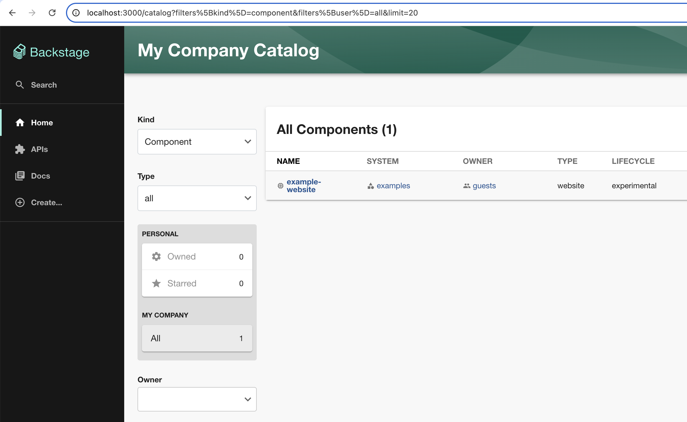
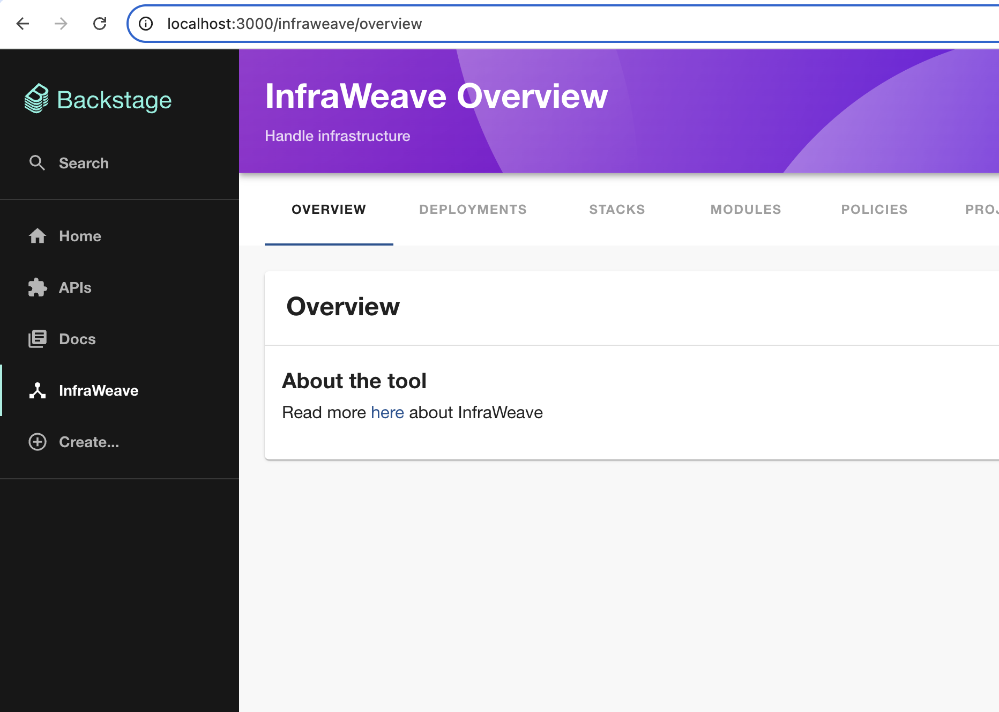
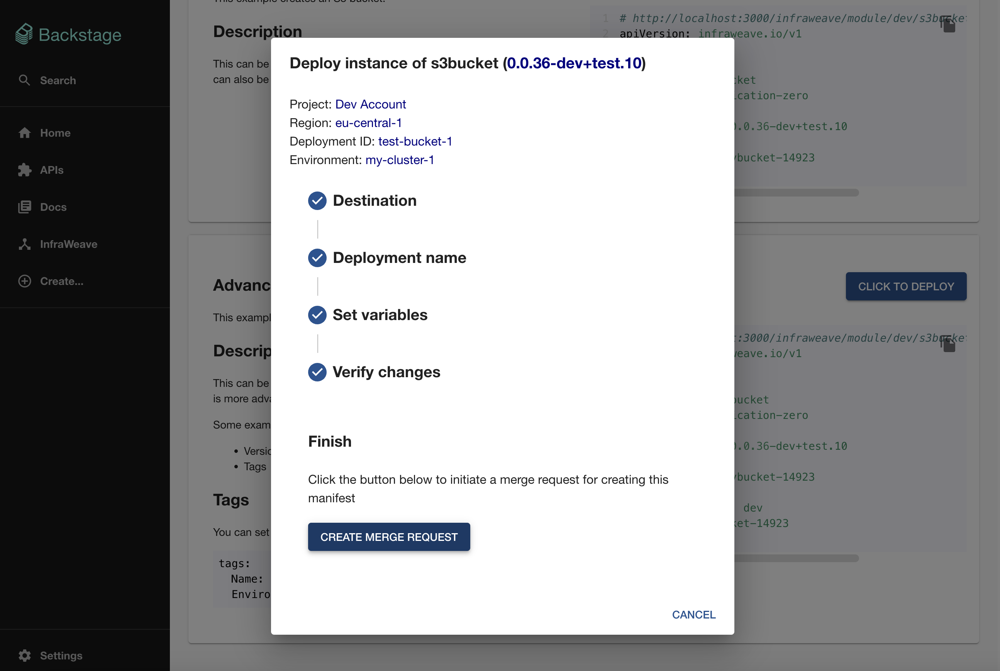

# Getting started


## Alternative 1 - Use directly

If you just want to run it to try it out, everything is ready in the `backstage-scaffold` folder, which is a result of following the instructions in alternative 2 below.

### How to run

```
cd backstage-scaffold
yarn start
```

## Alternative 2 - Set it up from scratch yourself

*For reference, the latest instructions for backstage are available on https://backstage.io/docs/getting-started/*

Here are all required steps:

### Create backstage scaffold

1. Run `npx @backstage/create-app@latest` to create an empty scaffold of backstage
1. Try launching the empty scaffold by running `cd <NAME_YOU_USED>` and then `yarn start`. It should look like this: 

### Set up frontend-plugin

1. Install the frontend plugin by running: `yarn add @infraweave/backstage-plugin-frontend`
1. Configure `app-config.yaml`
```diff
...
proxy:
  ### Example for how to add a proxy endpoint for the frontend.
  ### A typical reason to do this is to handle HTTPS and CORS for internal services.
-  # endpoints:
-  #   '/test':
-  #     target: 'https://example.com'
-  #     changeOrigin: true
+  endpoints:
+    '/api/infraweave':
+      target: 'http://localhost:8081' # Set to localhost to test locally
+      changeOrigin: true
+      logLevel: 'debug'
+      credentials: 'dangerously-allow-unauthenticated' # Dont have any authenication right now..
+      pathRewrite:
+        '^/api/proxy/api/infraweave': ''
...
```
1. Add plugin to the `backstage-scaffold/packages/app/src/App.tsx`
```diff
import { entityPage } from './components/catalog/EntityPage';
import { searchPage } from './components/search/SearchPage';
import { Root } from './components/Root';
+ import {
+   InfraweavePage,
+   InfraweaveDeploymentPage,
+   InfraweaveModulePage,
+   InfraweaveStackPage,
+   InfraweavePolicyPage,
+ } from '@infraweave/backstage-plugin-frontend';
...
...
    <Route path="/settings" element={<UserSettingsPage />} />
    <Route path="/catalog-graph" element={<CatalogGraphPage />} />
+    <Route path="/infraweave/:tab" element={<InfraweavePage />} />
+    <Route path="/infraweave/deployment/:project/:region/:environment/:deploymentId/:tab" element={<InfraweaveDeploymentPage />} />
+    <Route path="/infraweave/module/:track/:moduleName/:moduleVersion" element={<InfraweaveModulePage />} />
+    <Route path="/infraweave/stack/:track/:stackName/:stackVersion" element={<InfraweaveStackPage />} />
+    <Route path="/infraweave/policy/:environment/:policyName/:policyVersion" element={<InfraweavePolicyPage />} />
...
```
1. Add a button to InfraWeave by modifying the `backstage-scaffold/packages/app/src/components/Root/Root.tsx`
```diff
import ExtensionIcon from '@material-ui/icons/Extension';
import LibraryBooks from '@material-ui/icons/LibraryBooks';
+ import DeviceHub from '@material-ui/icons/DeviceHub';
...
...
        <SidebarItem icon={ExtensionIcon} to="api-docs" text="APIs" />
        <SidebarItem icon={LibraryBooks} to="docs" text="Docs" />
+        <SidebarItem icon={DeviceHub} to="infraweave/overview" text="InfraWeave" />
...
```
1. Done! Try it out by running `yarn start`. It should now look like this: 

### Set up backend-plugin (optional)

The backend-plugin is optional but is required if you want to allow creating merge requests from the module/stack pages using the ["Click to deploy" button](https://preview.infraweave.io/functionality/examples/#backstage): 

1. Install the backend plugin by running: `yarn add @infraweave/backstage-plugin-backend`
1. Add the plugin to `backstage-scaffold/packages/backend/src/index.ts`
```diff
import { createBackend } from '@backstage/backend-defaults';
+ import { githubBackendPlugin } from '@infraweave/backstage-plugin-backend';

const backend = createBackend();

+ backend.add(githubBackendPlugin);
backend.add(import('@backstage/plugin-app-backend'));
backend.add(import('@backstage/plugin-proxy-backend'));
...
```